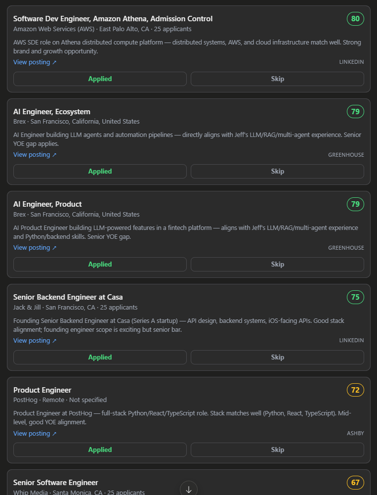

# job-search-mcp

A personal job-search assistant for **Claude Desktop**. You ask Claude to find jobs; it searches the
real job boards, **scores each one 0–100 for how well it fits you**, and shows them on a ranked board
you can triage with one click. Everything runs locally — no API keys, no accounts required.

It's an [MCP App](https://modelcontextprotocol.io): a small server Claude Desktop talks to, plus an
inline board that renders right in the chat.



---

## What it does

- **Searches real job boards** — LinkedIn plus 8 ATS/job sources (Greenhouse, Lever, Ashby, Workday,
  SmartRecruiters, Hacker News, RemoteOK, Remotive), using your target roles and location.
- **Scores each job for *you*** — Claude reads the full description and gives it a 0–100 fit score with
  a one-line reason, weighing your skills, years of experience, seniority fit, and the role.
- **Lets you triage fast** — Apply / Skip on each card, or in bulk ("dismiss everything under 60").
- **Remembers** — keeps a running shortlist, a tracker of what you've applied to, and won't show you
  the same job twice (for 6 months).

---

## Setup

**1. Build it**
```bash
npm install
npm run build
```

**2. Tell Claude Desktop about it.** Open your config file:
- Windows: `%APPDATA%\Claude\claude_desktop_config.json`
- macOS: `~/Library/Application Support/Claude/claude_desktop_config.json`

Add this under `"mcpServers"` (use the full path to *this* folder's `dist/main.js`):
```json
{
  "mcpServers": {
    "job-search": {
      "command": "node",
      "args": ["D:\\job-search-mcp\\dist\\main.js"]
    }
  }
}
```

**3. Fully quit and reopen Claude Desktop** (on Windows, quit it from the system tray — closing the
window isn't enough). That's it.

---

## How to use it

Just talk to Claude. For example:

- *"Save my profile"* — paste your resume first; Claude pulls out your skills, roles, years, and
  location so searches and scoring are tailored to you.
- *"Find backend engineer jobs in California, senior level, posted this week."*
- *"Find low-applicant jobs"* — adds LinkedIn's early-applicant filter.
- *"Dismiss everything under 60."*
- *"Show what I've applied to."*
- *"Re-score the board."*

A typical first run: **save your profile → "find jobs" → Claude scores them and shows the ranked
board → you Apply/Skip.**

---

## The board

The board is a **running shortlist**. A job stays on it until you **Apply** (moves to your tracker) or
**Skip** (hidden for good). New searches automatically skip jobs already on the board, in your tracker,
dismissed, or shown in the last 6 months — so you never see the same listing twice in a row.

Click **Applied** or **Skip** on a card, or ask Claude to do it. Triaged in the widget, it sticks.

---

## Tools (for reference)

You rarely call these by name — Claude picks the right one — but here's what's under the hood:

| Tool | What it does |
|---|---|
| `find_jobs` | Search the boards for your roles/location (with optional filters: seniority, type, recency, remote, salary, applicants, source). |
| `evaluate_jobs` | Claude scores the found jobs 0–100 for fit (runs automatically after a search). |
| `show_board` | Display the ranked board (or your `saved` tracker). |
| `set_status` | Apply / Skip / save a single job (also the card buttons). |
| `bulk_status` | Triage many at once by score or source, e.g. *dismiss everything under 60*. |
| `whats_promising` | List the current board as text (all scored jobs + anything still unscored). |
| `review_saved` | Your tracker — jobs you've saved or applied to. |
| `rescore_board` | Re-score every job on the board from scratch. |
| `clear_jobs` | Declutter: clear unscored leftovers or the whole board (never touches applied/dismissed). |
| `save_profile` | Save your resume profile (drives search + scoring). |

---

## Where your data lives

One JSON file on your machine — no cloud, nothing sent anywhere except the job boards you search:
- Installed: `~/.job-search-mcp/jobs.json`
- Running from source: `./data/jobs.json`
- Override with the `JOB_SEARCH_MCP_DATA` environment variable.

---

## Optional: LinkedIn Premium mode

By default LinkedIn uses its **public guest** endpoints — no login, no risk to your account, and you
already get full job descriptions. If you want richer/Premium data, you can use your logged-in account
by adding an `env` block to the server config:

```json
"job-search": {
  "command": "node",
  "args": ["D:\\job-search-mcp\\dist\\main.js"],
  "env": {
    "LINKEDIN_LI_AT": "<your li_at cookie>",
    "LINKEDIN_JSESSIONID": "ajax:1234567890123456789"
  }
}
```

Get both cookies from a logged-in `linkedin.com` tab → DevTools → Application → Cookies.

> ⚠️ **Heads up:** this is against LinkedIn's Terms of Service and can get your account flagged or
> restricted. The cookies also expire about monthly and LinkedIn's internal endpoints change without
> notice. If anything fails it falls back to guest mode automatically. Leave the `env` block out to
> stay fully safe (guest-only).

---

## How scoring works

Claude (the host model) does the scoring directly — it reads each description and judges fit, which is
well-calibrated. A deterministic formula (`computeMatchScore` in `scoring.ts`) is kept as a fallback for
anyone running a weaker local model that tends to over-rank everything; it's not active by default.

## Development

```bash
npm run typecheck    # type-check UI + server
npm run build        # build the UI bundle (vite single-file) + compile the server (tsc)
npm run serve:stdio  # run the server from source (tsx) for local testing
```

The server is stdio-only (`main.ts` → `server.ts`); the UI is a React app bundled to a single inlined
HTML file (`src/mcp-app.tsx` → `dist/mcp-app.html`) that the server serves as a `ui://` resource.
